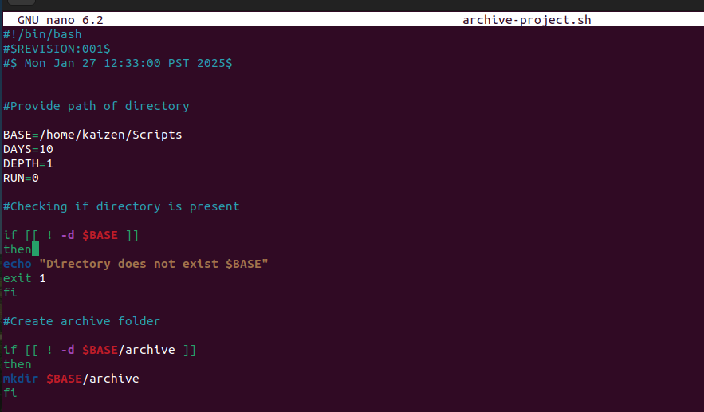
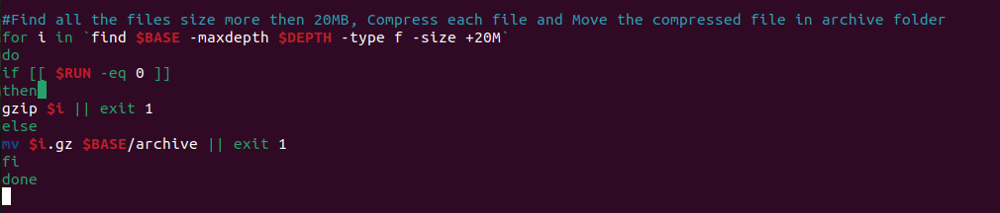
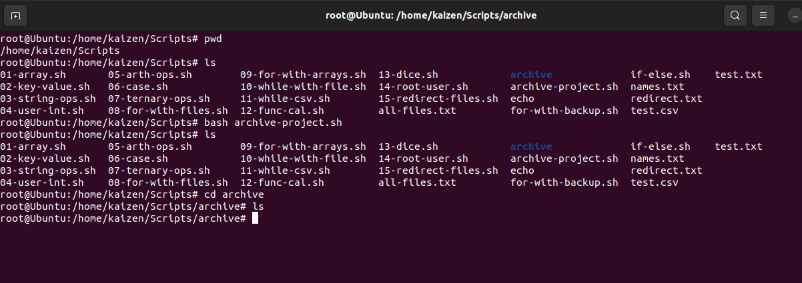

# File Archival Script

A Bash script for automatically identifying, compressing, and archiving large files in a specified directory.

## Features

- Identifies files larger than 10MB in size
- Compresses files using gzip compression
- Creates an archive directory if it doesn't exist
- Moves compressed files to archive location
- Configurable depth for file search
- Error handling for directory existence and operations

## Prerequisites

- Linux operating system
- Bash shell
- gzip utility
- Sufficient disk space for compressed files

## Configuration Variables

```bash
BASE=/home/kaizen/Scripts    # Base directory to monitor
DAYS=10                      # Days parameter (configurable)
DEPTH=1                      # Maximum depth for file search
RUN=0                        # Run mode (0 for compression, 1 for moving)
```

## Installation

1. Clone this repository or download the script
2. Make the script executable:
```bash
chmod +x archive_files.sh
```

## Usage

Run the script:

```bash
./archive_files.sh
```

The script will:
1. Check if the specified base directory exists
2. Create an archive directory if it doesn't exist
3. Find files larger than 10MB
4. Compress these files using gzip
5. Move compressed files to the archive directory

## Output

When successfully executed, the script processes files as follows:

```
$ ./archive_files.sh
Processing large files in /home/kaizen/Scripts...
Compressing: large_file1.txt
Moving: large_file1.txt.gz to archive
Compressing: large_file2.dat
Moving: large_file2.dat.gz to archive
```

### Example Screenshot:




*Screenshot shows the script executing and processing large files, in our case simply don't have any larger files but in your case it should behave as expected.*

## Directory Structure

```
/home/kaizen/Scripts/
├── archive/
│   ├── large_file1.txt.gz
│   └── large_file2.dat.gz
├── active_files/
└── archive_files.sh
```

## Error Handling

The script includes error checking for:
- Base directory existence
- Compression operations
- File movement operations

Error messages will be displayed if:
- Base directory doesn't exist
- Compression fails
- File movement fails

## Script Logic Flow

1. Verify base directory existence
2. Create archive directory if needed
3. Find files larger than 10MB within specified depth
4. For each file:
   - If RUN=0: Compress the file
   - If RUN=1: Move compressed file to archive

## Contributing

1. Fork the repository
2. Create your feature branch
3. Commit your changes
4. Push to the branch
5. Create a new Pull Request

## License

This project is licensed under the MIT License - see the LICENSE file for details.
